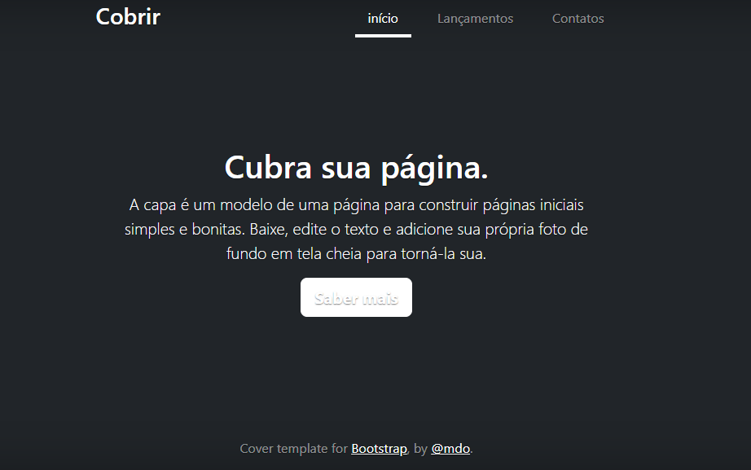

# Índice

[Projeto de portifólio pessoal](#portifolio_pessoal)  
[Descrição](#descri%C3%A7%C3%A3o)  
[Introdução](#introdu%C3%A7%C3%A3o)  
[Tecnologias utilizadas](#tecnologias-utilizadas)  
[Fontes consultadas](#fontes-consultadas)  
[colaboradores](#colaboradores) 
[Autores]() 

# Projeto do portifólio pessoal

Projeto criado utilizando exemplo de Bootstrap para ensino de uso do README e do Bootstrap

 ## Descrição
A partir das aulas de Programação Web, com o professor Leonardo Rocha, ele nos ensinou a documentar este projeto com o README para documentá-lo no GitHub, um meio para aprendermos melhor nossa escrita na programação e, consequentemente, entendermos melhor também aquilo que estamos fazendo e usando. 

 ## Introdução
O projeto foi feito com a principal funcionalidade de aprendermos a usar o Bootstrap e a documentá-lo com o README, comitando-o diretamente para o GitHub.

 ### Tecnologias utilizadas
 * VS Code(Visual Code) 
 * Bootstrap 
 * Github 
 * HTML 
 * CSS 
 * README 
 ## Fontes consultadas
 * Google 
  1. [Alura](https://www.alura.com.br/artigos/escrever-bom-readme) 
  2. [Dio.Me](https://www.dio.me/articles/personalize-o-readme-no-github)  
 * Colegas   
  1.[Witória](https://github.com/Witoriabeatriz) 
 ## Colaboradores
 * [Professor Leonardo Rocha](https://github.com/leonardossrocha) 
 ## Autores
 
